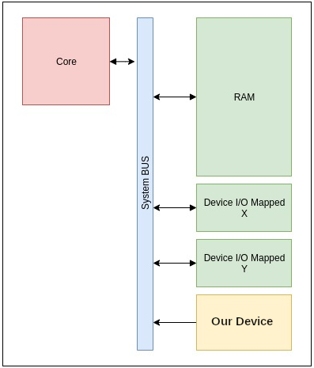

## 

> These are my notes about the process of creating a device driver for **QEMU** of the type TYPE_SYS_BUS_DEVICE. during a challenge creation process.

That's a device driver memory mapped attached to the main system bus, and not the pci bus.



I created it for  **qemu version 8.2.0** arm `virt` machine, but it can be applied to other machine with little modifications.

only 3 original files need modifications:

+ include/hw/arm/virt.h
+ hw/misc/meson.build
+ hw/arm/virt.c

Let's see each file modifications one by one:

------

### 1 - include/hw/arm/virt.h

We need to create a new entry in this include file in the first `enum`table.

That entry will be used to reference our driver, so let's choose a name, for example `VIRT_MYDEV`.

We have to add our entry just before the last entry `VIRT_LOWMEMMAP_LAST` as it indicates the end low memory mapping.

```c
   ...
   VIRT_MYDEV,
   VIRT_LOWMEMMAP_LAST,
};
```

------

### 2 - hw/misc/meson.build

In this file we have to add the name(s) of all the code source files that compose our driver,

they will be compiled and linked to the **QEMU** binary. We will put them all in the `hw/misc` subdirectory.

for example, if the source code file of our driver is named: `virt_mydev.c` we will add this line in `hw/misc/meson.build`:

```c
system_ss.add(files('virt_mydev.c'))
```

Actually the syntax could be more complex, we could have used variable that are set up during configure, for doing a conditional compilation. But we will keep it simple, and will compile unconditionaly our driver.

if you have multiple code source files you can also do like this, with the list of code source files:

```c
system_ss.add(files(
    'virt_mydev.c',
	'virt_mydev_second_file.c',
))
```

------

### 3 - hw/arm/virt.c

Well... it's here that the magic happens !

First we have to choose the memory addresses where our driver will be mapped, and that we will use to communicate with it.

We have to modify the table: `MemMapEntry base_memmap[]`

Here is it's original content:

```c
static const MemMapEntry base_memmap[] = {
    /* Space up to 0x8000000 is reserved for a boot ROM */
    [VIRT_FLASH] =              {          0, 0x08000000 },
    [VIRT_CPUPERIPHS] =         { 0x08000000, 0x00020000 },
    /* GIC distributor and CPU interfaces sit inside the CPU peripheral space */
    [VIRT_GIC_DIST] =           { 0x08000000, 0x00010000 },
    [VIRT_GIC_CPU] =            { 0x08010000, 0x00010000 },
    [VIRT_GIC_V2M] =            { 0x08020000, 0x00001000 },
    [VIRT_GIC_HYP] =            { 0x08030000, 0x00010000 },
    [VIRT_GIC_VCPU] =           { 0x08040000, 0x00010000 },
    /* The space in between here is reserved for GICv3 CPU/vCPU/HYP */
    [VIRT_GIC_ITS] =            { 0x08080000, 0x00020000 },
    /* This redistributor space allows up to 2*64kB*123 CPUs */
    [VIRT_GIC_REDIST] =         { 0x080A0000, 0x00F60000 },
    [VIRT_UART] =               { 0x09000000, 0x00001000 },
    [VIRT_RTC] =                { 0x09010000, 0x00001000 },
    [VIRT_FW_CFG] =             { 0x09020000, 0x00000018 },
    [VIRT_GPIO] =               { 0x09030000, 0x00001000 },
    [VIRT_SECURE_UART] =        { 0x09040000, 0x00001000 },
    [VIRT_SMMU] =               { 0x09050000, 0x00020000 },
    [VIRT_PCDIMM_ACPI] =        { 0x09070000, MEMORY_HOTPLUG_IO_LEN },
    [VIRT_ACPI_GED] =           { 0x09080000, ACPI_GED_EVT_SEL_LEN },
    [VIRT_NVDIMM_ACPI] =        { 0x09090000, NVDIMM_ACPI_IO_LEN},
    [VIRT_PVTIME] =             { 0x090a0000, 0x00010000 },
    [VIRT_SECURE_GPIO] =        { 0x090b0000, 0x00001000 },
    [VIRT_MMIO] =               { 0x0a000000, 0x00000200 },
    /* ...repeating for a total of NUM_VIRTIO_TRANSPORTS, each of that size */
    [VIRT_PLATFORM_BUS] =       { 0x0c000000, 0x02000000 },
    [VIRT_SECURE_MEM] =         { 0x0e000000, 0x01000000 },
    [VIRT_PCIE_MMIO] =          { 0x10000000, 0x2eff0000 },
    [VIRT_PCIE_PIO] =           { 0x3eff0000, 0x00010000 },
    [VIRT_PCIE_ECAM] =          { 0x3f000000, 0x01000000 },
    /* Actual RAM size depends on initial RAM and device memory settings */
    [VIRT_MEM] =                { GiB, LEGACY_RAMLIMIT_BYTES },
};
```

You can see that for each driver, an address and a length is chosen.

You can see also that there is a memory gap between `VIRT_MMIO` and `VIRT_PLATFORM_BUS`, so we will put our driver here at address `0x0b000000`, with a mapping length of `0x200` for example, which is more than enough for the few registers that we will define.

```c
    [VIRT_MMIO] =               { 0x0a000000, 0x00000200 },
    [VIRT_MYDEV] =              { 0x0b000000, 0x00000200 },     /* <-- our driver */
    /* ...repeating for a total of NUM_VIRTIO_TRANSPORTS, each of that size */
    [VIRT_PLATFORM_BUS] =       { 0x0c000000, 0x02000000 },
```

of course we have to use the device name `VIRT_MYDEV`that we defined before in `include/hw/arm/virt.h`

Next, we can define an interrupt reserved for our driver usage. Actually I do not used interrupts in my driver,

but here is how to choose one interrupt number.

We have to add an entry at the end of table:  `a15irqmap[]` like this:

```c
   [VIRT_PLATFORM_BUS] = 112, /* ...to 112 + PLATFORM_BUS_NUM_IRQS -1 */
   [VIRT_MYDEV] = 112 + PLATFORM_BUS_NUM_IRQS,
};
```

Next, we have to create an initialization function for our driver.

Here is a model of a basic initialization function:

```c
static void create_virt_mydev_device(const VirtMachineState *vms)
{
    MachineState *ms = MACHINE(vms);
    hwaddr base = vms->memmap[VIRT_MYDEV].base;
    hwaddr size = vms->memmap[VIRT_MYDEV].size;
    int irq = vms->irqmap[VIRT_MYDEV];
    char *nodename;

    sysbus_create_simple("virt-mydev", base, qdev_get_gpio_in(vms->gic, irq));
    nodename = g_strdup_printf("/virt_mydev@%" PRIx64, base);
    qemu_fdt_add_subnode(ms->fdt, nodename);
    qemu_fdt_setprop_string(ms->fdt, nodename, "compatible", "virt-mydev");
    qemu_fdt_setprop_sized_cells(ms->fdt, nodename, "reg", 2, base, 2, size);
    qemu_fdt_setprop_cells(ms->fdt, nodename, "interrupt-parent", vms->gic_phandle);
    qemu_fdt_setprop_cells(ms->fdt, nodename, "interrupts", GIC_FDT_IRQ_TYPE_SPI, irq, GIC_FDT_IRQ_FLAGS_LEVEL_HI);
    g_free(nodename);
}
```

The function will initialize the driver at the right mapping address, with the right length, and set up it's interrupt

And last (but not least), we have to add a call to our initialization function, in the function `machvirt_init()`

We will add it after the call to `create_virtio_devices(vms);`  (around line 2344)

```c
  create_virtio_devices(vms);
  create_virt_mydev_device(vms);
```

Like this, when the machine will be initialized, our driver will be initialized too.

And that's it, we have finished !!

Now we can configure **QEMU**, and build it, our driver will be compiled and linked to the `qemu-system-arm` or `qemu-system-aarch64` binary.

------

### 4 - A do-nothing driver example.

Here is an example of a template for a driver that does nothing except returning `0xdeadbeef`when you read at address offset 0.

It's up to you to add functionality to it, mapped registers, functions, etc....

```c
#include "qemu/osdep.h"
#include "hw/irq.h"
#include "hw/qdev-properties.h"
#include "hw/sysbus.h"
#include "hw/virtio/virtio.h"
#include "migration/qemu-file-types.h"
#include "qemu/host-utils.h"
#include "qemu/module.h"
#include "sysemu/kvm.h"
#include "sysemu/replay.h"
#include "hw/virtio/virtio-mmio.h"
#include "qemu/error-report.h"
#include "qemu/log.h"
#include "trace.h"
#include "hw/hw.h"
#include "qemu/bitops.h"

#define TYPE_VIRT_MYDEV          "virt-mydev"
#define VIRT_mydev(obj)          OBJECT_CHECK(VirtmydevState, (obj), TYPE_VIRT_MYDEV)

/* Register map */
#define MYDEV_OFFSET_ID 0x00

typedef struct {
    SysBusDevice parent_obj;
    MemoryRegion iomem;
    qemu_irq irq;
} VirtmydevState;

static uint64_t virt_mydev_read(void *opaque, hwaddr offset, unsigned size)
{
    VirtmydevState *s = (VirtmydevState *)opaque;

    switch (offset) {
    case MYDEV_OFFSET_ID:
        return 0xdeadbeef;
    default:
        break;
    }
    return 0;
}

static void virt_mydev_write(void *opaque, hwaddr offset, uint64_t value,                  unsigned size)
{
    VirtmydevState *s = (VirtmydevState *)opaque;

    switch (offset) {
    case MYDEV_OFFSET_ID:
            return -1;
    default:
        break;
    }
}

static const MemoryRegionOps virt_mydev_ops = {
    .read = virt_mydev_read,
    .write = virt_mydev_write,
    .endianness = DEVICE_NATIVE_ENDIAN,
};

static void virt_mydev_realize(DeviceState *d, Error **errp)
{
    VirtmydevState *s = VIRT_mydev(d);
    SysBusDevice *sbd = SYS_BUS_DEVICE(d);

    memory_region_init_io(&s->iomem, OBJECT(s), &virt_mydev_ops, s, TYPE_VIRT_MYDEV, 0x200);
    sysbus_init_mmio(sbd, &s->iomem);
    sysbus_init_irq(sbd, &s->irq);
}

static void virt_mydev_class_init(ObjectClass *klass, void *data)
{
    DeviceClass *dc = DEVICE_CLASS(klass);
    dc->realize = virt_mydev_realize;
}

static const TypeInfo virt_mydev_info = {
    .name          = TYPE_VIRT_MYDEV,
    .parent        = TYPE_SYS_BUS_DEVICE,
    .instance_size = sizeof(VirtmydevState),
    .class_init    = virt_mydev_class_init,
};

static void virt_mydev_register_types(void)
{
    type_register_static(&virt_mydev_info);
}

type_init(virt_mydev_register_types)
```

------

### 5 - Let's test it

So, let's test it now. 

Configure qemu like you want, and compile  `qemu-system-arm` or `qemu-system-aarch64`, the driver will be compiled too.

Choose you most loved `arm` vm, and boot it.

if you have a look in directory `/sys/devices/platform/` you will see a file named `b000000.virt_mydev`

that's our driver,  `b000000`is the mapping address we chosed, and `virt_mydev`its name.

for communicating with it , we can use a lesser known function of `busybox`, the `devmem`function, that works like this:

```sh
sudo busybox devmem
BusyBox v1.27.2 (Ubuntu 1:1.27.2-2ubuntu3.4) multi-call binary.

Usage: devmem ADDRESS [WIDTH [VALUE]]

Read/write from physical address

	ADDRESS	Address to act upon
	WIDTH	Width (8/16/...)
	VALUE	Data to be written
```

Very useful for debugging and communicating with a memory mapped driver.

So let's try to communicate with our driver:

```sh
sudo busybox devmem 0xb000000
0xDEADBEEF
```

Bingo, you can see that our driver is working, and that it returns us the almost mystical value `0xdeadbeef`that every pwner know..

------

### 6 - So... What's next ?

Now that everything works as expected.

You can start from this template , and implement your own functions, add memory mapped registers, functions, etc, etc..

If you want to read or write to guest ram memory for example, you can use the function:

```c
void cpu_physical_memory_rw(hwaddr addr, uint8_t *buf, int len, int is_write);
```

with it you can read or write (depending on `is_write` value) in the ram of the guest,

from `hwaddr addr`to local `buf`, or in the inverse direction.

you can find more details on `QEMU` internals on the airbus seclab site:

[https://airbus-seclab.github.io/qemu_blog/](https://airbus-seclab.github.io/qemu_blog/)

