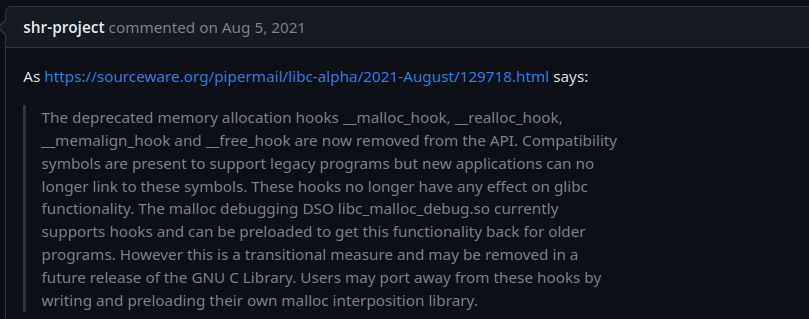
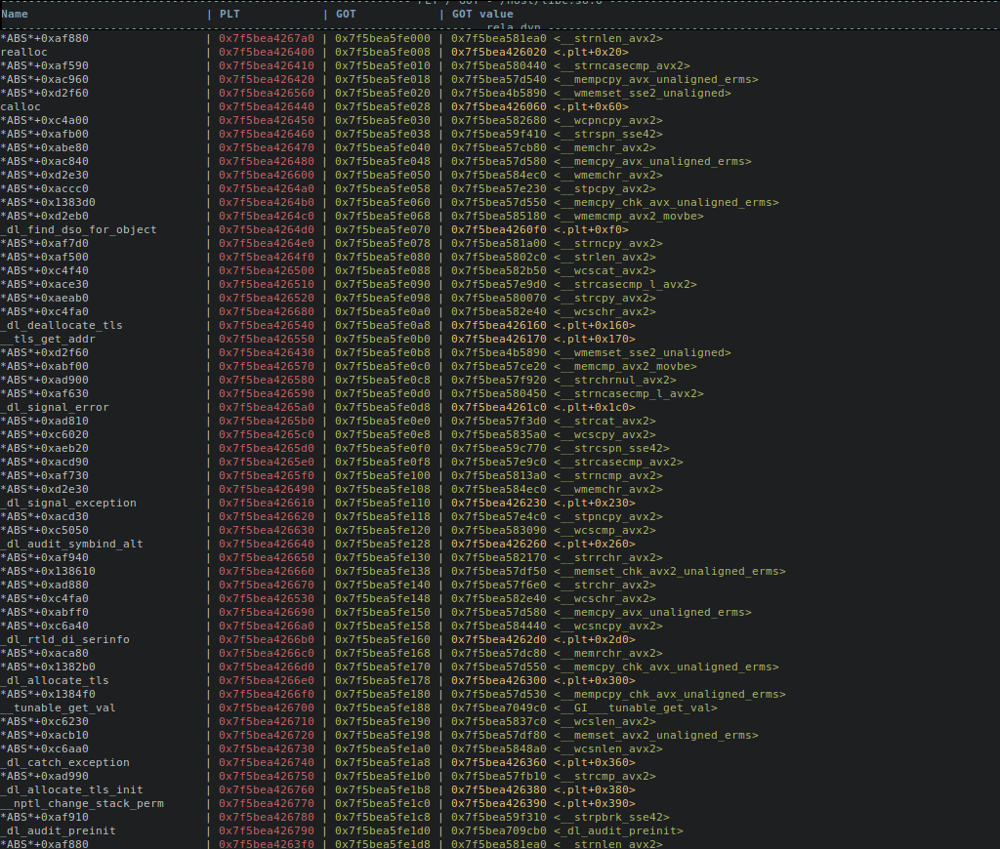
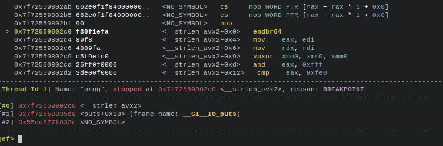

## Code execution with a write primitive on last libc.


### 1- Introduction

This article will try to summarize the various ways to obtain code execution on the last libc with a write primitive.

Of course it is not limited to heap exploitation challenges, it could be any type of controlled write primitive.

We will target libc or ld indifferently,  as ld.so is included in libc source code.

At the time of writing (October 2023.),  last libc version is 2.38, so I will use this version for all my experiments.

It will be updated as new versions of libc will appear.

The goal of this article is more practical than theoretical. I will share here infos, code example, python macros, anything that could be directly used in exploits.

Since libc 2.34, all the classic memory allocation hooks that many **pwners** used in libc have been removed. Actually , there are still present in libc, but are no more used. as you can see in this announce:



so we will focus of what is still working.

In recent libc, many function pointers inside libc are mangled: they are xored with a random value, that is stored in `tls-storage`, and they are also shifted.

To create a mangled function pointer, you need first to leak this random value to be able to forge a function pointer.

So it requires one more leak , that complicates exploitation.

`tls-storage` is mapped by  `ld.so` during loading of executable required libs, and is most of the time mapped just before `libc`. But depending on the number and order of loaded libraries, could be mapped elsewhere sometimes.

`tls-storage`, which is pointed by `fs`segment register on x86_64, contains the random value used to create mangled function pointer, it contains also the `canary`used to protect stack from buffer overflow, and other variables.

------

### C program template for our experiments

Here is a small C program that we will use for our experiments:

```c
// gcc -g -o prog prog.c
#include <stdio.h>
#include <stdint.h>
#include <stdlib.h>

static void setup() {
        setvbuf(stdin, NULL, _IONBF, 0);
        setvbuf(stdout, NULL, _IONBF, 0);
        setvbuf(stderr, NULL, _IONBF, 0);
}

uint64_t getint(char *msg)
{
char buf[64];

	printf("%s", msg);
	fgets(buf,64,stdin);
	return strtoul(buf,0,10);
}

int main()
{
uint64_t choice;
uint64_t addr;
uint64_t size;

	setup();
	printf("libc stdout leak: %p\n", stdout);
	while(1)
	{
		puts("1. write data to addr");
		puts("2. exit");
		choice = getint("choice> ");
		if (choice == 2)
			break;
		else if (choice == 1)
		{
			addr = getint("address> ");
			size = getint("size> ");
			printf("data> ");
			fread((void *)addr,size,1,stdin);
		}
		else
			continue;
	}
	return(0);
}
```

This program will be enough, to experiments writing in various part of `libc`, or `ld.so` memory.

I provide also a version of ld and libc.so with full debug symbols.

The program first print a leak of `stdout` libc address, in your real exploit, it's up to you to get a libc leak of course  😋

If you don't have a leak in your exploit, you should read how to use a partial write over `stdout` structure for leaking a libc address before starting:   [Using stdout as a read primitive](https://github.com/nobodyisnobody/docs/tree/main/using.stdout.as.a.read.primitive)

Last but not least, if you plan to experiment with the provided `prog.c` and debugging,

I hotly recommend you to use the fork of `gef ` by **bata24**,  which is so great for debugging:

[https://github.com/bata24/gef](https://github.com/bata24/gef)

it adds many new commands for examining data structures (like tls-storage, got entries, etc , etc..)

It is such a great gdb extension that you should not work with something else anymore .. believe me..

------

### 1 - Targetting libc GOT entries.

If you check `libc.so.6` in most linux distro you will see that most of them use protection `Partial Relro`

```sh
checksec libc.so.6
[*] './libc.so.6'
    Arch:     amd64-64-little
    RELRO:    Partial RELRO
    Stack:    Canary found
    NX:       NX enabled
    PIE:      PIE enabled
```

that means that `GOT` entries are writable, and so,  are a perfect target for code execution as they are not mangled.

let's have a look at them on `bata24 gef`for  `gdb`, for that, look at the `libc.so.6` file used by the `prog` binary

and do under gdb:

```sh
got -f /fullpath/libc.so.6
```

you have to indicate full path of libc used, or by default got will dump only main binary `GOT` entries.

let's have a look to a part of these got entries (as the list is a bit long):



In this screenshot, the `GOT` start at RW libc zone `0x7fe3d73fe000`

you can see that most entries are strings functions, optimized for the cpu current architecture, (maybe that's why they keep the GOT half relro, to update strings function at runtime...)

These functions in `GOT` are called by many other libc functions. To know which `GOT` entry you should target , you can for example put breakpoint in the `GOT` entries, then when the breakpoint is reached see stack backtrace to find which libc function call this `GOT` entry, or you can search in glibc source code too, or look at libc disassembly with objdump..

For example, libc `puts()` function is calling `__strlen_avx2` as you see:



then you can check when reaching the breakpoint the state of registers, to see if a onegadget could pass for example.

if your gadget does not pass in a `GOT` entry, looks at this write-up, how to chain two gadgets for modifying registers to make the `onegadget` works:  [https://github.com/nobodyisnobody/write-ups/tree/main/RCTF.2022/pwn/bfc#code-execution-inferno]( https://github.com/nobodyisnobody/write-ups/tree/main/RCTF.2022/pwn/bfc#code-execution-inferno)

------

### 2 - Targetting ld.so link_map structure.

The prerequisite for this way to achieve code execution, is that the program must exits via `return`, or via `exit()` libc function.

In the two cases, libc will execute `__run_exit_handlers()` function that will call any `dtors`registered , and will cleanup various things before exiting.

If the program exits via `_exit()` function  (which name starts with an underscore), the `exit` syscall will be directly called, and the exit handlers will not be executed. You can set a breakpoint in `__run_exit_handlers()`  to verify that it is executed at exit, in case you doubt..

