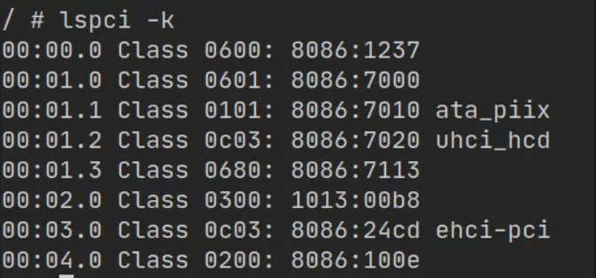

# CVE-2020-14364 QEMU escape vulnerability analysis

Rough translation from:
https://mp.weixin.qq.com/s/MQyczZXRfOsIQewNf7cfXw

for a nice implementation, look at the sampriti exploit for RealWorld CTF 2022 "Blackbox challenge"
https://gist.github.com/sampritipanda/a619520f0764f868288361b162e7c67b


The CVE-2020-14364 qemu escape vulnerability is an array out-of-bounds vulnerability located in the QEMU USB module. It can easily read and write any address within a certain range to achieve escape and RCE. On August 25th, part of the POC code and utilization ideas were published online. This article uses this as a reference to record the process of local utilization to reproduce EXP.

**startup**

- ##### Compared with the common qemu startup script, adding a gdb --args to the first line can start qemu with gdb

- Need to enable usb and add a usb device

The startup script used in this reproduction is as follows, adding a usb2.0 device

```bash
#!/bin/sh
gdb --args ./qemu-system-x86_64 -m 128M -usb -device usb-ehci,id=ehci -device usb-tablet,bus=ehci.0 -kernel ./bzImage -initrd  ./rootfs.img -append "root=/dev/ram rw console=ttyS0 oops=panic panic=1 kalsr uid=0" -netdev user,id=t0, -device e1000,netdev=t0,id=nic0 -nographic -smp cores=2,threads=1 -enable-kvm -cpu kvm64,+smep
```

position

Use the lspci command to check the bus number of the usb device. here is 03.0




First, a brief overview of the vulnerability situation

**usb_process_one**

The function to process the usb package, the parameter is the USBPacket structure, and one of the three operations of setting, reading and writing is performed according to the pid in the Packet.

**do_token_setup**


- The value of s->setup_len comes from setup_buf
- When the length check of s->setup_len fails, setup_len is not cleared & s->setup_status is not set
- s->setup_len will not be reset when processing the next USBPacket

**do_token_in & out**


- The key parts of the two are similar, mainly because the detection of len is that if it is greater than p->iov.size, it will be directly set to p->iov.size, and p->iov.size is the controllable data we send in the USBPacket , so this detection can be easily bypassed
- s->setup_state needs to be set to SETUP_STATE_DATA in advance
- s->setup_buf[0] also needs to be constructed in advance, and decides whether to read or write

**usb_packet_copy**


The direction of buffer copying is read or write, determined by USBPacket *p->pid

QH&QTD

Referring to the EHCI drive analysis of an online blog, you can simply understand the concept


**Utilize the base**


For the interactive method of QEMU exploits, you can refer to the MMIO section in this article, which will not be repeated in this article.

qemu pwn-basic knowledge: https://xz.aliyun.com/t/6562

**interact**


ehci_opreg_write will be called when the mmio write operation is performed


When mmio_write, different functions and interactions will be triggered according to addr and val. (Note that the addr here also needs to add an offset of 0x20. For the specific reason, you can check the source code yourself)

**outsourcing**

The process of sending a basic USB Packet is as follows, the part that needs to be constructed is mainly the part in the red box

qtd->token contains p->pid and p->iov.size, and p->pid determines the USBPacket to enter do_token_setup/in/out


Out-of-bounds read and write


### step1

Just construct a normal packet, set s->setup_state = SETUP_STATE_DATA in do_token_setup, and prepare for later

### step2

Continue to enter do_token_setup, set s->setup_len to 0x5000, and the value of sizeof(s->data_buf) to 0x2000, so the array can be out of bounds. And at this time s->setup_state is still 2 (SETUP_STATE_DATA)


### step3

Since s->setup_buf[0] is set to 0 in step1, now you can only enter do_token_out for write operations

Observe that after data_buf, the out-of-bounds write to the hijackable data member:

```c
struct USBDevice {
    DeviceState qdev;
    USBPort *port;
    char *port_path;
    void *opaque;
    uint32_t flags;

    /* Actual connected speed */
    int speed;
    /* Supported speeds, not in info because it may be variable (hostdevs) */
    int speedmask;
    uint8_t addr;
    char product_desc[32];
    int auto_attach;
    int attached;

    int32_t state;
    uint8_t setup_buf[8];
    uint8_t data_buf[4096];
    int32_t remote_wakeup;
    int32_t setup_state;
    int32_t setup_len;
    int32_t setup_index;

    USBEndpoint ep_ctl;
    USBEndpoint ep_in[USB_MAX_ENDPOINTS];
    USBEndpoint ep_out[USB_MAX_ENDPOINTS];

    QLIST_HEAD(, USBDescString) strings;
    const USBDesc *usb_desc; /* Overrides class usb_desc if not NULL */
    const USBDescDevice *device;

    int configuration;
    int ninterfaces;
    int altsetting[USB_MAX_INTERFACES];
    const USBDescConfig *config;
    const USBDescIface  *ifaces[USB_MAX_INTERFACES];
};
```

Note the setup_index and setup_len behind data_buf, and setup_buf is in front of it

```c
usb_packet_copy(p, s->data_buf + s->setup_index, len);
```

The starting position of usb_packet_copy is the address of data_buf plus setup_index, so if it is out of bounds and changed to a negative number, the next time you write, you can start writing from setup_buf, and control the value of setup_buf[0], so that you can enter do_token_in for out-of-bounds reading fetch operation


Rewrite setup_index by out-of-bounds writing, pay attention to control the out-of-bounds range through p->iov.size, do not destroy extra data, otherwise it will cause crash


In the second write, set setup_buf[0] to USB_DIR_IN (0x80), and at the same time continue to write out of bounds to set setup_index, so that the pointer of usb_packet_copy next time points to s->ep_ctl.dev behind data_buf


The address of s->data_buf can be obtained through dev. With this address as the base, adding or subtracting setup_index can realize arbitrary read and write in the range of 0xffffffff, which is enough to complete the escape.

**leak text**

After observing data_buf, there are some pointers to the text segment at the fixed offset, which can be used to get the address of the code segment and the address of the system PLT located in it


​                                                                                    **RCE**


Observe ehci_update_irq, you can find that it calls the function pointer in the EHCIState->irq structure, and its parameters are also in the irq structure. The EHCIState address is obtained through the previous out-of-bounds read and write, and the irq structure can be hijacked to complete the escape and execute arbitrary code.


others implementations :

https://github.com/gejian-iscas/CVE-2020-14364/blob/main/exp.c

https://github.com/y-f00l/CVE-2020-14364/blob/main/exp.c

https://github.com/De4dCr0w/Vulnerability-analyze/blob/master/CVE-2020-14364-Qemu%E9%80%83%E9%80%B8%E6%BC%8F%E6%B4%9E/exp2_config_read.c

